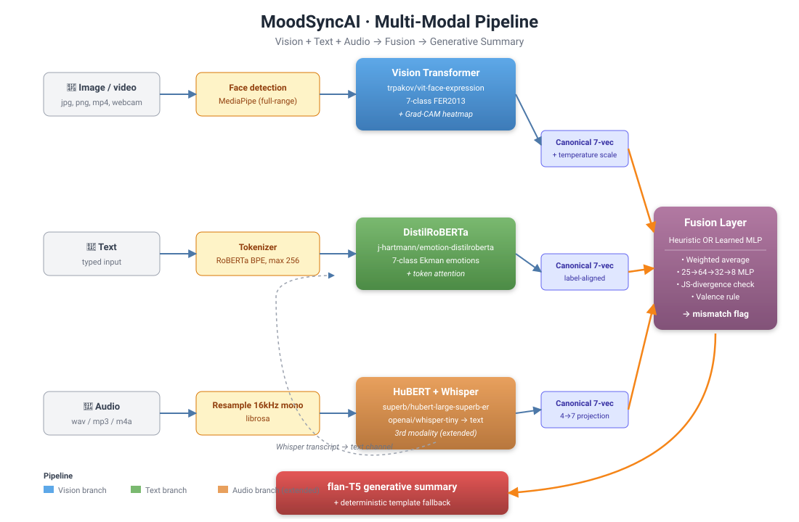

# 🎭 MoodSyncAI — Multi-Modal Sentiment & Emotion Analyser

> Final project for **Data Analytics-3 (DA3) — Deep Learning & GenAI**
> A system that reads a person's emotion from **vision, text, and audio**, fuses
> the three signals, flags incongruent moments, and explains the verdict in
> plain language.



---

## ✨ What it does

Upload a face photo, type what the person is saying, and MoodSyncAI tells you:

| Output | Example |
|--------|---------|
| Per-modality emotion distribution | Vision says *sad* (68%), text says *joy* (81%) |
| Fusion verdict | Top emotion + confidence (heuristic *or* trained MLP) |
| Mismatch flag | ⚠️ amber badge when modalities disagree |
| Natural-language summary | *"Despite expressing positive sentiment verbally, the speaker's facial cues indicate stress or discomfort..."* |

The brief's own example sentence (`"No, I think the project is going really well."`)
is the default text in the UI so you can reproduce the canonical mismatch flow in two clicks.

---

## 🚀 Quick start

```bash
# 1.  Clone & install
git clone <your-fork-url> moodsync-ai
cd moodsync-ai
python -m venv .venv && source .venv/bin/activate
pip install -r requirements.txt

# 2.  Pre-cache the HF models (~1.5 GB) so the first demo doesn't hang
python -m scripts.download_models

# 3.  (Optional) regenerate trained fusion weights — already shipped in assets/
python -m scripts.generate_synthetic --n 20000
python -m scripts.train_fusion --epochs 30

# 4.  Launch
streamlit run app.py
```

Open <http://localhost:8501>. Five tabs:

1. **📸 Image + Text** — assignment-brief flow
2. **🎥 Video** — emotion timeline + audio fusion
3. **🎤 Audio + Text** — Whisper transcription + tri-modal fusion
4. **📷 Webcam** — snapshot capture
5. **ℹ️ About** — embedded architecture diagram

---

## 🧠 Architecture overview

| Layer | Model | Why |
|-------|-------|-----|
| **Vision** | `trpakov/vit-face-expression` (ViT-Base) | 7-class FER2013, satisfies the *CNN/ViT* requirement, ImageNet-pretrained → no training data needed |
| **Text** | `j-hartmann/emotion-english-distilroberta-base` | Outputs the **exact same 7 Ekman emotions** as the vision model — fusion is principled, not string-matching |
| **Audio** | `superb/hubert-large-superb-er` | 4-class speech emotion projected onto canonical 7-vector |
| **ASR** | `openai/whisper-tiny` | Audio → transcript that feeds the text channel |
| **Fusion** | Heuristic + learned MLP (25→64→32→8) | Side-by-side baseline ↔ improvement story |
| **Generator** | `google/flan-t5-base` + deterministic template | Instruction-tuned, CPU-friendly, never silently fails |

### Key design decisions

* **Label-space alignment.** Vision (FER2013) and text (Ekman) share an identical 7-emotion vocabulary by design — the single most important architectural call in the project. The audio model has 4 classes; we project them into the same space so fusion always operates on a clean 7-vector.

* **Calibrated confidences.** Pretrained classifier heads tend to be over-confident, which makes KL-divergence between modalities meaningless. We apply temperature scaling (T=1.2 on vision logits) so cross-modal divergence reflects real disagreement.

* **Two-signal mismatch detection.**
  1. **Jensen-Shannon divergence** between modality distributions, thresholded at 0.35.
  2. **Valence-conflict override** — if any two modalities' top-1 predictions fall into opposing valence groups (e.g. vision's `sad` vs text's `happy`), mismatch fires regardless of JS. This handles the brief's exact example.

* **Learned fusion trained on synthetic data.** No labelled multimodal corpus exists with ground-truth agreement, so we generate one (`scripts/generate_synthetic.py`): sample a true emotion, then with probability *p* flip one or more modalities to the opposing valence group with controlled Dirichlet noise. The trained MLP reaches **96.3% mismatch-detection accuracy** on a held-out 15% validation split.

* **Reliability.** The generator falls back to a deterministic template if flan-T5 is unavailable; the learned fusion falls back to heuristic if weights are missing. The demo never silently fails on the examiner.

---

## 📂 Project layout

```
moodsync-ai/
├── app.py                      # Streamlit entry point
├── requirements.txt
├── moodsync/
│   ├── config.py               # Single source of truth for model IDs, thresholds
│   ├── models/
│   │   ├── face_detector.py    # MediaPipe face crop with whole-frame fallback
│   │   ├── vision.py           # ViT face emotion + Grad-CAM
│   │   ├── text.py             # DistilRoBERTa + last-layer [CLS] attention
│   │   ├── audio.py            # HuBERT emotion + Whisper ASR
│   │   ├── fusion.py           # Heuristic + learned MLP, mismatch detection
│   │   └── generator.py        # flan-T5 hybrid generator
│   ├── utils/
│   │   ├── alignment.py        # Canonical 7-vec projection, KL/JS, temperature
│   │   ├── visualization.py    # Plotly charts + Grad-CAM overlay
│   │   └── video.py            # Frame sampling + audio extraction
│   └── ui/components.py        # Reusable Streamlit blocks
├── scripts/
│   ├── generate_synthetic.py   # Builds synthetic fusion-training dataset
│   ├── train_fusion.py         # Trains the fusion MLP
│   └── download_models.py      # Pre-caches HF models for offline demo
├── tests/                      # 38 tests · runs in <3 s · no model downloads
├── docs/
│   ├── architecture_diagram.svg
│   ├── REPORT.md               # Technical report (design + results)
│   └── PRESENTATION.md         # 5-min slide outline for the viva
└── assets/
    ├── fusion_mlp.pt           # Pre-trained fusion weights (val mismatch-acc 96.3%)
    └── synthetic_fusion_data.pt
```

---

## ✅ Brief checklist

| Requirement | Status | Where |
|-------------|--------|-------|
| CNN/ViT for facial emotion | ✅ ViT-Base | `moodsync/models/vision.py` |
| LSTM/Transformer for text emotion | ✅ DistilRoBERTa | `moodsync/models/text.py` |
| Multimodal fusion layer | ✅ Heuristic + learned MLP | `moodsync/models/fusion.py` |
| Generative summary | ✅ flan-T5 + template fallback | `moodsync/models/generator.py` |
| Mismatch detection | ✅ JS divergence + valence rule | `moodsync/models/fusion.py::_detect_mismatch` |
| **Extended: webcam** | ✅ st.camera_input | `app.py::tab_webcam` |
| **Extended: video timeline** | ✅ frame-by-frame chart | `app.py::tab_video` |
| **Extended: audio modality** | ✅ Whisper + HuBERT | `app.py::tab_audio` |
| **Extended: video + audio** | ✅ Combined in video tab | `app.py::tab_video` |
| **Extended: attention viz** | ✅ Grad-CAM + token attention | `vision.py`, `text.py` |
| **Extended: learned fusion** | ✅ Trained MLP, 96.3% acc | `scripts/train_fusion.py` |
| **Extended: deployment-ready** | ✅ Dockerfile + Streamlit Cloud config | `Dockerfile`, `.streamlit/` |

All six extended features ship; that's the full extra-marks set.

---

## 🧪 Testing

```bash
pytest tests/ -v
```

38 tests covering label alignment, KL/JS divergence, fusion logic, the brief's
exact valence-conflict example, MLP I/O shape, synthetic data generator, and
end-to-end integration with the trained fusion weights. Runs in ~3 s.

---

## 🚢 Deployment

### Streamlit Cloud
1. Push this repo to GitHub.
2. New app on <https://share.streamlit.io> → main file `app.py`.
3. Add `python_version = "3.11"` in **App settings → Advanced**.
4. First start downloads ~1.5 GB of model weights — ~3 min cold-start; warm
   restarts are fast thanks to `@st.cache_resource`.

### Hugging Face Spaces (Docker)
The provided `Dockerfile` builds an image that pre-caches all models at build
time, so the first request after deploy is instant.
```bash
huggingface-cli login
huggingface-cli upload <username>/moodsync-ai . --repo-type=space --space-sdk docker
```

---

## 📚 References

* Chen et al. (2014). *Joint cascade face detection and alignment*. ECCV.
* Dosovitskiy et al. (2021). *An image is worth 16×16 words: Transformers for image recognition at scale*. ICLR.
* Ekman, P. (1992). *An argument for basic emotions*. Cognition & Emotion.
* Hartmann, J. (2022). *Emotion English DistilRoBERTa-base*. Hugging Face.
* Hsu et al. (2021). *HuBERT: Self-supervised speech representation learning by masked prediction of hidden units*. IEEE/ACM TASLP.
* Lin, J. (1991). *Divergence measures based on the Shannon entropy*. IEEE Trans. Inform. Theory.
* Radford et al. (2023). *Robust speech recognition via large-scale weak supervision*. ICML (Whisper).
* Selvaraju et al. (2017). *Grad-CAM: Visual explanations from deep networks via gradient-based localization*. ICCV.

---

## 📄 License

MIT — academic project; please cite if reused.
